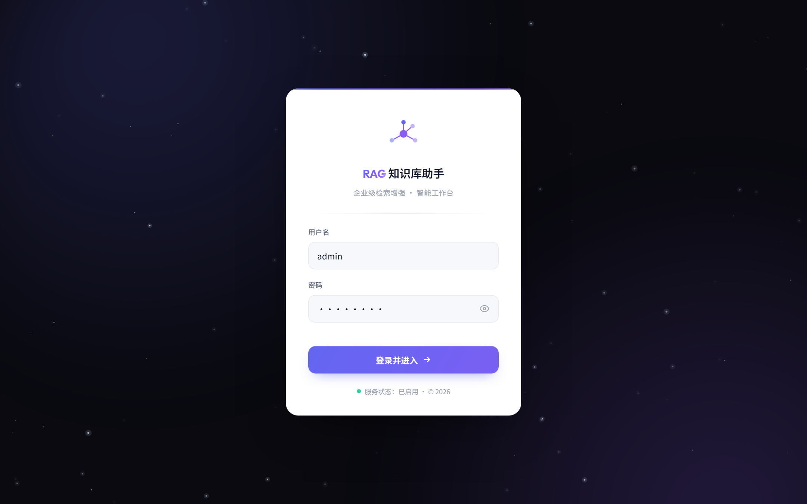
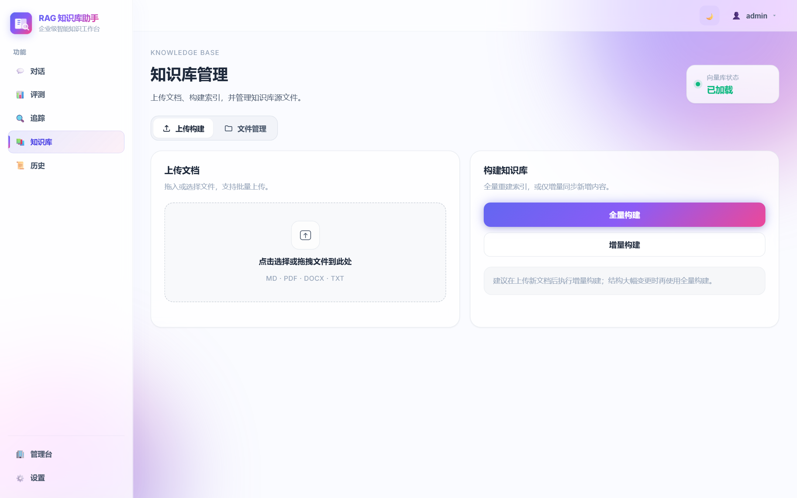
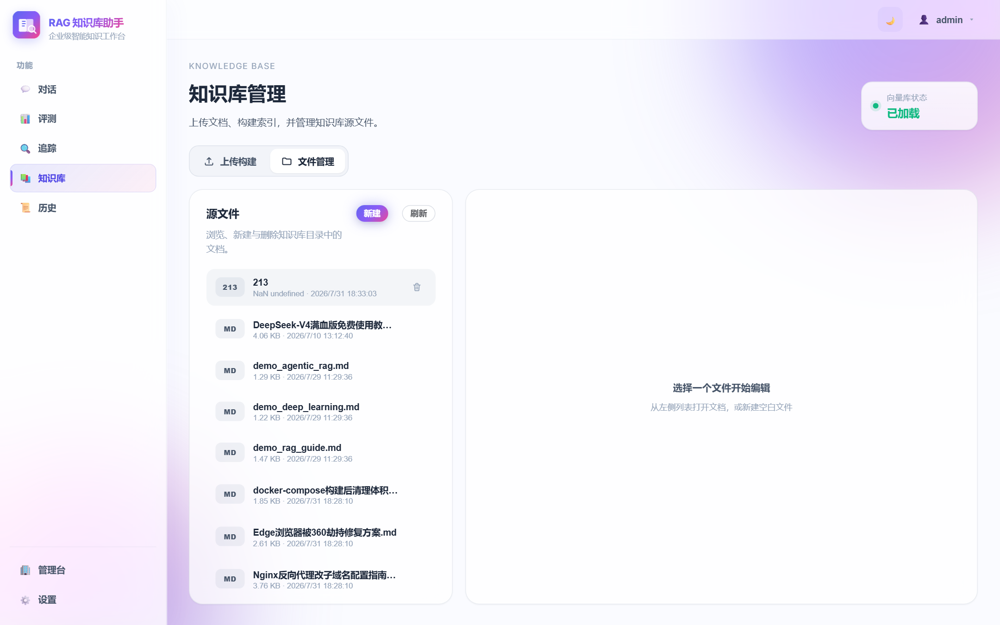
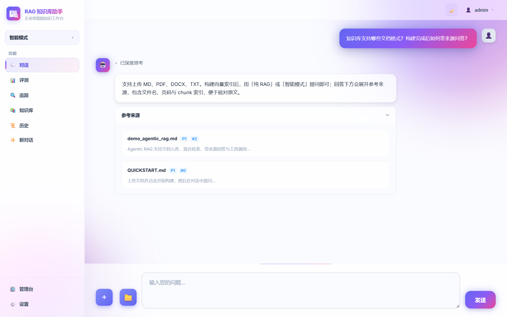
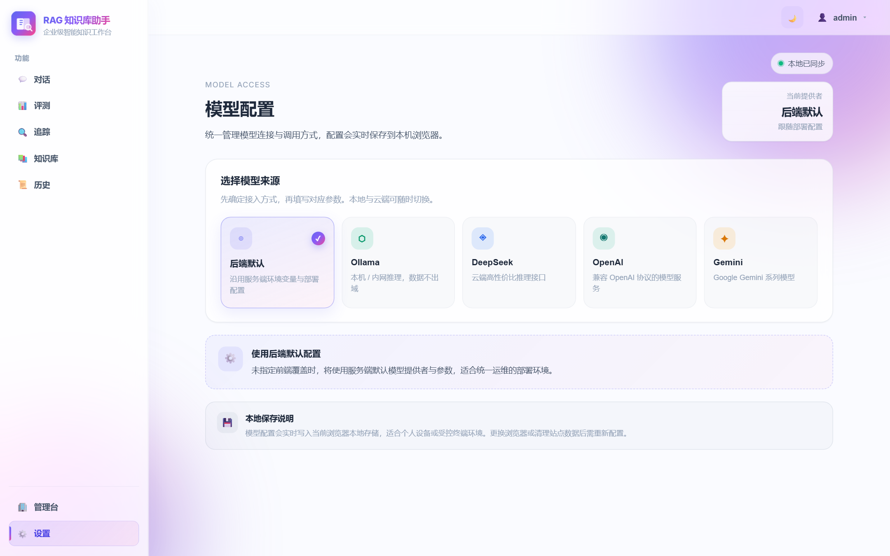

# Agentic RAG Knowledge Base

<p align="center">
  <b>把文档变成可对话的知识系统</b><br/>
  Local-first Agentic RAG for private / on-prem knowledge Q&A
</p>

<p align="center">
  <a href="#quick-start"></a>
  <a href="LICENSE"></a>
  
  
  
  
  
  
</p>

<p align="center">
  <a href="#english">English</a> ·
  <a href="START_HERE.md">Start Here</a> ·
  <a href="QUICKSTART.md">Quickstart</a> ·
  <a href="docs/ENTERPRISE_DEPLOYMENT.md">Enterprise</a> ·
  <a href="docs/AGENT_ARCHITECTURE.md">Architecture</a>
</p>

一个面向**本地部署 / 私有知识管理**的 Agentic RAG 系统：文档入库 → 混合检索 → 带来源问答 → Agent 工具调用 → 可选联网搜索。

适合：想快速搭私有知识库的团队，以及想在 RAG 之上继续做 Agent / 多模型 / 企业能力的开发者。

<p align="center">
  
</p>


---

## 为什么不是「又一个 RAG Demo」

| 常见 RAG 项目 | 本项目 |
| --- | --- |
| 检索 → 一次生成回答 | **RAG + ReAct Agent**，可规划、调工具、多步推理 |
| 只有向量检索 | **向量 + BM25 混合检索 + Rerank** |
| 脚本级 PoC | **Vue 3 完整前端**：流式对话、来源、历史、文件管理 |
| 绑定单一云厂商 | **Ollama / DeepSeek / OpenAI / Gemini** 可切换 |
| 难二次开发 | **FastAPI + MCP Server**，可接入 Cursor / Claude Desktop |
| 无评测 | **内置 RAG 回测**（vector / bm25 / hybrid） |
| 难上生产 | **多租户、JWT/OIDC、审计、配额、Prometheus/Grafana** |

---

## 核心能力

- **Agentic Workflow** — ReAct 推理循环：规划 → 工具调用 → 汇总
- **Hybrid Retrieval + Rerank** — ChromaDB + BM25，bge-reranker-v2-m3 精排
- **GraphRAG** — 轻量知识图谱，实体关系与多跳查询
- **Streaming Chat UI** — 流式回答、思维过程、来源（页码 / chunk）
- **Local Embedding** — bge-small-zh-v1.5，可完全离线
- **Incremental Index** — 文件哈希增量重建
- **MCP Server** — `rag_search` / `graph_query` 接入 IDE Agent
- **RAG Evaluation** — CLI + 前端一键回测
- **Enterprise Ops** — 多租户、审计、配额、Webhook、PII/ABAC、数据保留、合规导出、监控告警
- **Web Search Ready** — 可选 SearXNG / Tavily

---

## 产品预览

| 登录页 | 首页工作台 |
| :---: | :---: |
|  |  |

| 知识库构建 | 文件管理 |
| :---: | :---: |
|  |  |

| 带来源问答 | 智能 Agent |
| :---: | :---: |
|  |  |

| 设置 |
| :---: |
|  |

---

## Tech Stack

```text
Frontend   Vue 3 · Vite · Element Plus
Backend    FastAPI · JWT / OIDC
Retrieval  ChromaDB · BM25 · Reranker · GraphRAG
LLM        Ollama · DeepSeek · OpenAI · Gemini
Ops        Docker Compose · Prometheus · Grafana · MCP
```

## 架构一览

```text
┌─────────────┐     ┌──────────────────────┐     ┌─────────────────┐
│  Vue 3 UI   │────▶│  FastAPI + Agent     │────▶│  LLM Providers  │
│  Chat/KB/   │ SSE │  ReAct · Tools · MCP │     │  Ollama/Cloud   │
│  Eval/Admin │◀────│                      │◀────│                 │
└─────────────┘     └──────────┬───────────┘     └─────────────────┘
                               │
                    ┌──────────▼───────────┐
                    │ Hybrid Retriever     │
                    │ Vector + BM25 + Graph│
                    │ + Incremental Index  │
                    └──────────────────────┘
```

---

## Quick Start

### 环境要求

- Python **3.10+**
- Node.js **18+**
- 可选：[Ollama](https://ollama.com)（本地模型）

### 1. 安装与配置

```bash
pip install -r requirements.txt
cd frontend && npm install && cd ..
cp .env.example .env
```

在 `.env` 中至少配置一种模型：

| 模式 | 关键配置 |
| --- | --- |
| 本地 | `MODEL_PROVIDER=ollama` |
| 云端 | `MODEL_PROVIDER=deepseek` / `openai` / `gemini` + 对应 API Key |

### 2. 一键启动

**Windows**

```powershell
powershell -ExecutionPolicy Bypass -File .\start.ps1
# 或双击 start.bat
```

**macOS / Linux**

```bash
bash start.sh
```

**手动启动**

```bash
python run_api.py          # API  → http://localhost:8000
cd frontend && npm run dev # UI   → http://localhost:5173
```

**Docker Compose**

```bash
cp .env.example .env
docker compose up -d --build
# Web → http://localhost
```

### 3. 第一次使用

1. 打开前端 → **设置** 选择模型提供者  
2. 上传 `md / pdf / docx / txt`  
3. **构建知识库**  
4. 用「纯 RAG」或「智能模式」提问  

### 4. 进阶

```bash
# RAG 回测
python run_backtest.py --build

# MCP（Cursor / Claude Desktop）
python mcp_server.py
```

---

## 项目结构

```text
.
├── src/
│   ├── agent/        # Agent、工具、意图路由
│   ├── api/          # FastAPI 路由
│   ├── core/         # 向量库、检索、文档处理
│   ├── services/     # LLM、会话、RAG
│   ├── config/       # 配置
│   └── utils/        # 日志、监控、重试
├── frontend/         # Vue 3 前端
├── deploy/           # Docker / 监控 / SearXNG
├── docs/             # 文档与截图
├── documents/        # 默认知识源
└── vector_db/        # 向量持久化
```

## 常用配置

详见 [`.env.example`](.env.example)：

- `MODEL_PROVIDER` / `DEEPSEEK_API_KEY` / `OLLAMA_MODEL` / `OLLAMA_API_URL`
- `VECTOR_DB_PATH` / `TOP_K` / `MAX_TOKENS`
- 联网搜索：`TAVILY_API_KEY`

## 文档

| 文档 | 说明 |
| --- | --- |
| [Start Here](START_HERE.md) | 最短上手路径 |
| [Quickstart](QUICKSTART.md) | 快速开始 |
| [Agent 架构](docs/AGENT_ARCHITECTURE.md) | ReAct / 工具路由 |
| [企业部署](docs/ENTERPRISE_DEPLOYMENT.md) | 多租户与运维 |
| [Demo 素材清单](docs/DEMO_ASSETS_CHECKLIST.md) | 截图 / GIF |
| [日志排查](LOG_QUICK_GUIDE.md) | 排障 |

---

<a id="english"></a>

## English

**Agentic RAG Knowledge Base** is a local-first knowledge Q&A system for private deployments:

- Hybrid retrieval (vector + BM25) with reranking  
- ReAct agent with tool calling and optional web search  
- Vue 3 streaming chat UI with citations and history  
- Multi-provider LLMs: Ollama, DeepSeek, OpenAI, Gemini  
- MCP server for Cursor / Claude Desktop  
- Built-in RAG evaluation and enterprise ops hooks  

```bash
pip install -r requirements.txt
cd frontend && npm install && cd ..
cp .env.example .env
# set MODEL_PROVIDER + API key (or Ollama)
bash start.sh   # or start.ps1 / start.bat on Windows
```

Open `http://localhost:5173`, upload documents, build the index, and chat.

---

## Roadmap

- 更稳的默认配置与新手引导  
- HuggingFace Spaces / 在线 Demo  
- 更完整的英文文档与示例知识库  
- Agent 工具生态与插件市场  

欢迎 Star / Issue / PR。如果你在私有化或中文知识库场景落地了，也欢迎分享反馈。

## License

[MIT](LICENSE)
