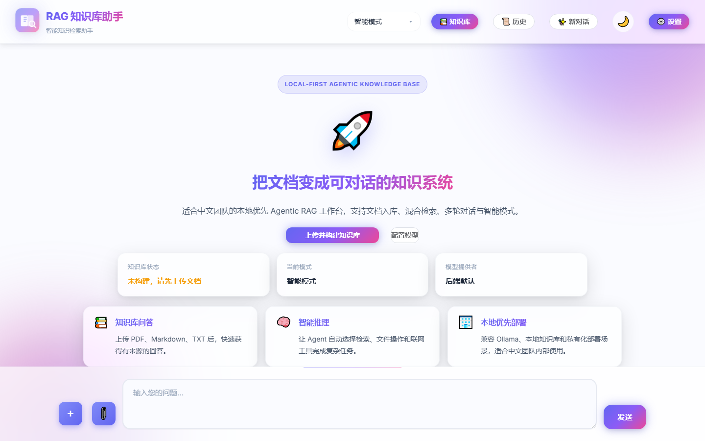
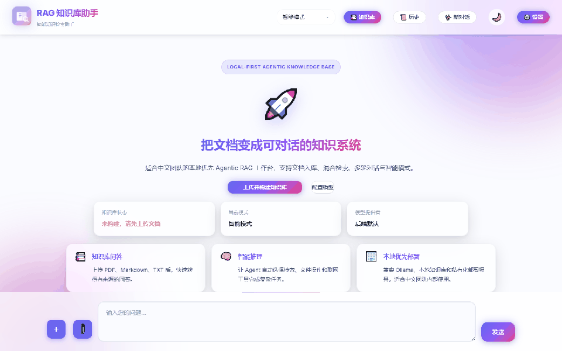

# Agentic RAG 知识库系统

一个面向本地部署和私有知识管理的 Agentic RAG 项目：支持文档入库、混合检索、对话问答、工具调用和联网搜索。

> Local-first Agentic Knowledge Base for Chinese teams.





快速入口：[`Start Here`](START_HERE.md) · [`Quickstart`](QUICKSTART.md) · [`Docker Compose`](#4-docker-compose) · [`Demo Assets`](docs/DEMO_ASSETS_CHECKLIST.md)

这个仓库当前的定位更适合两类人：

- 想快速搭建一个可运行的私有知识库问答系统
- 想在现有 RAG 工程上继续迭代 Agent、工具调用和多模型接入能力

## Why This Project

很多知识库项目只能“检索然后回答”，而这个项目已经具备继续进化成产品的几个关键基础：

- `RAG + Agent` 双模式，既能做纯知识库问答，也能做多步骤推理
- `FastAPI + Vue 3` 前后端分离，便于二次开发
- `Ollama / DeepSeek / OpenAI / Gemini` 多模型接入思路
- 文档上传、知识库构建、会话历史、文件管理等基本产品能力
- 为联网搜索、图像/视频生成、文件处理等工具扩展预留了结构

## Product Preview

建议在这里逐步补齐对外展示素材：

- 首页首屏：`docs/images/home-hero.png`
- 知识库构建：`docs/images/kb-build.png`
- 带来源问答：`docs/images/chat-with-sources.png`
- 智能模式：`docs/images/agent-mode.png`
- 文件管理：`docs/images/file-manager.png`

## Core Features

- **Agentic Workflow**: 基于 ReAct 的推理循环，支持规划、工具调用和结果汇总
- **Hybrid Retrieval**: 向量检索 + BM25 检索，兼顾语义和关键词召回
- **Knowledge Base Management**: 支持文档上传、构建、编辑与删除
- **Streaming Chat UI**: 支持流式回答、思维过程展示、来源展示和历史会话
- **Model Flexibility**: 兼容本地模型与云端模型接入
- **Web Search Ready**: 可选接入 SearXNG / Tavily 等搜索能力

## Tech Stack

- Backend: `FastAPI`
- Frontend: `Vue 3` + `Vite` + `Element Plus`
- Retrieval: `ChromaDB` + `BM25`
- LLM Access: `Ollama` / `DeepSeek` / `OpenAI` / `Gemini`

## Project Structure

```text
.
├── src/
│   ├── agent/        # Agent 核心、工具注册、意图路由
│   ├── api/          # FastAPI 路由与应用入口
│   ├── core/         # 向量库、检索器、文档处理
│   ├── services/     # LLM 客户端、会话管理、RAG 服务
│   ├── config/       # 配置项
│   └── utils/        # 日志、监控、重试等通用能力
├── frontend/         # Vue 前端
├── deploy/           # Docker / SearXNG 等部署配置
├── docs/             # 补充文档
├── documents/        # 默认知识源目录
└── vector_db/        # 向量库持久化目录
```

## Quick Start

### 1. Prepare Environment

建议环境：

- Python `3.10+`
- Node.js `18+`
- 可选：`Ollama`

安装依赖并配置环境变量：

```bash
pip install -r requirements.txt
cd frontend && npm install
cp .env.example .env
```

至少配置一种模型来源：

- 本地：`MODEL_PROVIDER=ollama`
- 云端：`MODEL_PROVIDER=deepseek` 或 `openai` 或 `gemini`

### 2. Start With One Command

#### Windows

```powershell
powershell -ExecutionPolicy Bypass -File .\start.ps1
```

#### macOS / Linux

```bash
bash start.sh
```

### 3. Start Manually

```bash
# terminal 1
python run_api.py

# terminal 2
cd frontend
npm run dev
```

默认地址：

- API: `http://localhost:8000`
- Swagger: `http://localhost:8000/docs`

默认地址：

- Web UI: `http://localhost:5173`
- API Docs: `http://localhost:8000/docs`

### 4. Docker Compose

```bash
cp .env.example .env
docker compose up -d --build
```

默认地址：

- Web UI: `http://localhost`
- API Docs: `http://localhost:8000/docs`

### 5. First Run Flow

1. 打开前端页面
2. 在“设置”中选择模型提供者
3. 上传 `md / pdf / docx / txt` 文档
4. 构建知识库
5. 使用 `纯 RAG` 或 `智能模式` 发起提问

## Configuration

环境变量样例见 `.env.example`。最常用的是：

- `MODEL_PROVIDER`
- `DEEPSEEK_API_KEY`
- `OLLAMA_MODEL`
- `OLLAMA_API_URL`
- `VECTOR_DB_PATH`
- `TOP_K`
- `MAX_TOKENS`

如果你使用联网搜索，还需要按需配置：

- `TAVILY_API_KEY`

## Current Product Surface

当前前端已经提供以下能力：

- 聊天问答
- 历史会话管理
- 文档上传与知识库构建
- 文档文件管理与在线编辑
- 模型提供者切换
- 深色模式

这意味着本项目已经不只是“RAG 脚本”，而是一个可以继续打磨成完整产品的雏形。

## Documentation

- [Start Here](START_HERE.md)
- [Quickstart](QUICKSTART.md)
- [Demo Assets Checklist](docs/DEMO_ASSETS_CHECKLIST.md)
- [性能优化](docs/PERFORMANCE_OPTIMIZATION.md)
- [Agent 架构说明](docs/AGENT_ARCHITECTURE.md)
- [SearXNG 配置](docs/SEARXNG_SETUP.md)
- [日志排查](LOG_QUICK_GUIDE.md)

## Product Gaps To Improve

如果你的目标是把它打造成更有传播力、更容易涨星的开源项目，接下来最值得投入的是：

- 更强的首页展示素材：GIF、截图、架构图、对比图
- 一键部署与 Docker Compose 全链路体验
- 更清晰的 benchmark / demo 数据集 / 示例问题
- 更稳定的默认配置与新手引导
- 更聚焦的产品定位，而不是“功能很多但主线不够清楚”

## Roadmap Direction

一个更容易获得社区关注的方向是把项目重新聚焦为：

> **Local-first Agentic Knowledge Base for Chinese teams**

也就是：

- 优先本地 / 私有化部署
- 优先中文知识库体验
- 优先 Agent + RAG 的实际落地，而不是论文式堆概念

## License

MIT

